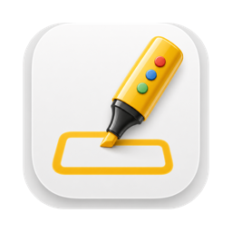

<p align="center">
  
</p>

<h1 align="center">ScreenBox</h1>

<p align="center"><b>Draw on your screen while you record.</b></p>

A tiny macOS menu bar app for drawing highlight boxes on screen while recording or presenting.

Press a hotkey, drag a box around whatever you're talking about, and it fades away on its own. No editing pass, no timeline annotations.

## Install

Requires macOS 13 or later. The build is universal, so it runs natively on both
Apple silicon and Intel.

**1. Install it.** Grab **ScreenBox-x.y.z.dmg** from the
[latest release](https://github.com/Orva-Studio/screenbox/releases/latest), open
it, and drag ScreenBox to Applications. (The `.zip` next to it is the same app,
for scripted installs.)

**2. Clear the quarantine flag.** This is the command you have to run after
installing from the DMG:

```bash
xattr -dr com.apple.quarantine /Applications/ScreenBox.app
```

Without it macOS refuses to open the app — it's only ad-hoc signed, there's no
Apple Developer account behind it, so anything downloaded gets quarantined. You
only do this once. (If you'd rather not use the terminal: right-click the app and
choose **Open**, then confirm — on Ventura and later you may need **System
Settings → Privacy & Security → Open Anyway** instead.)

**3. Launch it.** Double-click ScreenBox in Applications. Nothing appears in the
Dock and no window opens — ScreenBox runs as a menu bar app, so the only sign
it's running is the box icon up in the menu bar. (It won't show up in ⌘-Tab
either.) Then press **⌃⌥⌘B** to draw.

There's no installer, no background daemon, and no Accessibility permission to
grant — the app is a menu bar icon and a global hotkey, nothing else. To have it
start with your Mac, add it to **System Settings → General → Login Items**.

To uninstall, quit it from the menu bar and drag `/Applications/ScreenBox.app`
to the trash; `defaults delete local.screenbox` clears its saved preferences.

## Build

```bash
./build.sh
open build/ScreenBox.app
```

Requires the Swift toolchain (Xcode or Command Line Tools). No dependencies.

To keep a build you made yourself, drag `build/ScreenBox.app` to `/Applications`
— a local build isn't quarantined, so it opens without the step above.

## Use

**⌃⌥⌘B** toggles draw mode on whichever screen the mouse is on.

While drawing:

| Key | Action |
| --- | --- |
| drag | draw with the current tool |
| `P` `A` `R` `O` `T` `H` | freehand / arrow / rectangle / ellipse / text / highlighter |
| `1`–`5` | blue / red / green / yellow / purple |
| `S` | toggle the spotlight |
| `B` | show/hide the toolbar |
| `X` | click through — let clicks and scrolling reach the app underneath |
| `[` `]` | thinner / thicker stroke (spotlight size, while it's up) |
| `−` `=` | less / more corner radius |
| `F` | toggle fade-out on/off |
| `⌘Z` | undo last mark |
| `C` | clear all, stay in draw mode |
| `esc` | clear and exit draw mode |

The **highlighter** drags a wide translucent band in the current colour, so
whatever it covers still reads through — yellow over a line of code or a
paragraph works the way you'd expect. Its width follows the stroke thickness
(`[` and `]`), scaled up.

The **spotlight** dims the whole screen except a soft-edged circle that follows
the pointer, for pulling attention to one part of a demo. It's a mode, not a
tool: every drawing tool still works while it's on. `[` and `]` resize it, or
pick a size from **Spotlight Size** in the menu.

`B` hides the floating **toolbar** for a clean recording and brings it back —
every tool, colour and mode on it has a key equivalent, so nothing is lost while
it's away. The state is saved like the other preferences, and **Show Toolbar**
in the menu finds it again if you forget the key.

**Click through** (`X`, the toolbar button, or **⌃⌥⌘X** from anywhere) hands
clicks and scrolling back to whatever is underneath, so you can scroll the page
you're demoing without leaving draw mode. Existing marks stay on screen; you
just can't draw new ones until it's off. The menu bar icon changes while it's
active, since clicks going straight through is otherwise indistinguishable from
having exited.

Because every click passes through, the way back can't be a click on the
overlay — use the global **⌃⌥⌘X**, the `X` key (while ScreenBox still has
focus), or the toolbar button, which is a separate window and keeps taking
clicks — or **Click Through** in the menu bar, which is where the changed icon
is pointing anyway. Hiding the toolbar with `B` costs you the button; the other
three still work. Leaving draw mode clears it too.

By default the pointer is **left alone** in draw mode — no crosshair, no I-beam —
so a recording doesn't give away that an annotation tool is running. Turn off
**Keep Normal Cursor** in the menu if you'd rather have the crosshair back.

> `⌘Z` only applies to marks still on screen. With fade on (the default) a mark
> is gone about a third of a second after you release the mouse, so there is
> usually nothing left to undo. Press `F` to turn fade off first.

## Preferences

Colour, thickness, corner radius, fade speed, and fade on/off all live in the
menu bar and are **saved automatically** — change them however you like and
they'll be the same next launch. Keyboard changes made mid-draw persist too.

Defaults: yellow, 4pt, square corners, fast fade.

Preferences are stored in `UserDefaults` under `local.screenbox`. To reset
everything:

```bash
defaults delete local.screenbox
```

### Adding a preference

`Sources/Prefs.swift` is the single source of truth. Add a `Key` case, a
computed property, and a default in `register(defaults:)`. Because every write
fires `onChange`, the menu re-ticks and the live overlay redraws with no extra
wiring.

## Releases

The version is derived from git tags — nothing to bump by hand. `build.sh`
stamps `CFBundleShortVersionString` from the latest tag (`v1.2.0` → `1.2.0`, or
`1.2.0-dev` for commits after it) and `CFBundleVersion` from the commit count.
The running version shows at the bottom of the menu.

To cut a release:

```bash
./scripts/release.sh 1.2.0
```

It refuses unless you're on a clean `main`, fast-forwards, checks the tag is
free, does a smoke build so a broken commit can't burn a tag, then tags and
pushes.

The push triggers `.github/workflows/release.yml`, which builds a universal
binary on `macos-latest`, packages it as both a drag-to-install `.dmg` and a
`.zip`, and publishes a GitHub release with both attached.

To build a disk image by hand:

```bash
./build.sh
./scripts/make-dmg.sh          # -> build/ScreenBox-<version>.dmg
```

The app is only **ad-hoc signed**, so Gatekeeper quarantines it on download and
the release notes tell people to right-click → Open (or run `xattr -dr
com.apple.quarantine`). Fixing that properly needs an Apple Developer account:
sign with a Developer ID certificate, then `xcrun notarytool submit --wait` and
`xcrun stapler staple` in the workflow.

## Notes

- The overlay window only exists while draw mode is active, so it never
  intercepts clicks when you're working normally.
- While draw mode *is* active the overlay swallows clicks on that screen — press
  `X` to click through, or `esc` to leave.
- Boxes are stroked with a dark halo so they stay readable on light and dark
  backgrounds.
- Uses a Carbon hotkey, so no Accessibility permission is required.
- Draws over normal windows but not over fullscreen apps.

## Licence

MIT — see [LICENSE](LICENSE).

## Fade speed presets

| Preset | Hold | Fade |
| --- | --- | --- |
| Instant | 0s | 0.15s |
| Fast (default) | 0.15s | 0.2s |
| Medium | 0.35s | 0.4s |
| Slow | 1.0s | 0.8s |

Edit `Prefs.speedChoices` in `Sources/Prefs.swift` to change or add presets.
